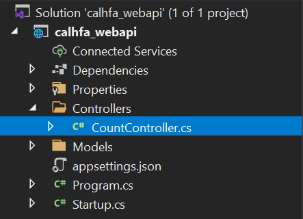
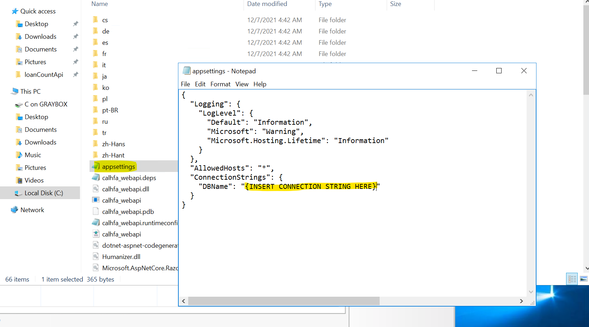

*Justin Heyman, Team Lead; David Enzler, Lead Software Developer; Isaac Williams, Developer; Johnny Velazquez, Developer; and Jamal Stanackzai, Developer.* 

# Table of Contents
1. <a href='#1'> Project Overview </a>
	1.1. <a href='#1.1'> Technology Stack and Components </a>
	1.2. <a href='#1.2'> API Features </a>
	1.3. <a href='#1.3'> How the API Works </a>
	1.4. <a href='#1.4'>	SQL query logic </a>
2. <a href='#2'> Tutorials </a>
	2.1. <a href='#2.1'> Run and debug the program in the development environment </a>
	2.2. <a href='#2.2'> Stop home page redirecting to swagger </a>
	2.3. <a href='#2.3'> Publishing for Deployment </a>
	2.4. <a href='#2.4'> Deploying to IIS </a>

<div style="page-break-after: always;"></div>

# <div id='1'> 1. Project Overview </div>

## <div id='1.1'> 1.1 Technology Stack and Core Components </div>
* Visual Studio 2019 16.11.5
* ASP.NET Core 5.0.0
* Entity Framework Core 5.0.11
* Microsoft SQL Server
* IIS Express
* Swagger (Swashbuckle.AspNetCore 5.6.3)

### ASP.NET Core 5.0.0
We used the ASP.NET Core Web API template offered by Visual Studio 19 as a starting point. This template comes with optional configurations for HTTPS and Swagger, which we enabled.

 
 ### Entity Framework Core 5.0.11
*Note: We originally went with Entity Framework with the intention of using LINQ to query the database. Ultimately, we decided to configure EF to take a raw SQL query for performance, and for our own student enrichment.*

For EF, we installed these nuget packages
* [Microsoft.EntityFrameworkCore.SqlServer 5.0.11](https://www.nuget.org/packages/Microsoft.EntityFrameworkCore.SqlServer/5.0.11)
* [Microsoft.EntityFrameworkCore.Tools 5.0.11](https://www.nuget.org/packages/Microsoft.EntityFrameworkCore.Tools/5.0.11)

The EF tools package was used to auto-scaffold the models and context classes based on the database schema given to us by CalHFA. The same tool can be used to perform data migrations, should the schema ever change. 

This is the command we used to scaffold the database classes into the models directory:
`Scaffold-DbContext "{INSERT CONNECTION STRING HERE}" Microsoft.EntityFrameworkCore.SqlServer -OutputDir Models`

Refer to this link for more on the EF tools package
[Official documentation for EF tools](https://docs.microsoft.com/en-us/ef/core/cli/powershell)

### SQL Server
We developed our API with Microsoft SQL Server in mind. Our application was tested using local and remote connection strings with SQL Express and Azure, respectively. The query itself was developed and tested within SQL Server Management Studio before integrating it with the API.

### IIS Express 
IIS Express is the default launch option for debugging the API on a local webserver with minimal setup. You may also switch this option to use the Kestrel / dotnet CLI directly.

### Swagger
The VS19 ASP.NET Core Web API template comes with options for Swagger configuration, which we utilized. We also configured the API to redirect the home page to Swagger during debugging and runtime. To disable this feature, refer to the how-to section of this document. This is in the **Startup.cs** class.

<div style="page-break-after: always;"></div>

# <div id='1.2'> 1.2 API Features </div>
1. Entity Framework Core for database interfacing, LINQ queries, automated scaffolding, and migrations
2. Compatible with SQL server
3. Easily change database connection by changing one line of code (using connection string)
4. Support for raw SQL queries using Entity Framework Core
5. Lean SQL queries for optimal performance
6. Works ONLY on https
7. Implements Swagger UI
8. Streamlined deployment process with visual studio


# <div id='1.3'> 1.3 How the API Works </div>


**Starting Point**
1. The API begins with a call to "https://{server_address}/api/count"
2. When the endpoint is called, the API looks for the appropriate controller to handle the call.


<div style="page-break-after: always;"></div>
    
**CountController**

1. The CountController is the specified route for calls to ./api/count
2. CountController's default call is to GetLoanCount which returns the count and dates of the queues on the website


3. The function uses a RawSql query instead of EF Core's standard LINQ

	* *Note: RawSQL is much faster*
4. EF Core differs from previous versions: it forces a return type to be defined for any raw SQL query.
	* This return type is defined in the models

**Models**

1. The models are responsible for outlining the tables from the database which the API can use
	* There can be an arbitary number of tables from the database modelled
    * Each model is a table, and each model has several functions which specify the columns for each table.
2. IMPORTANT: The ReviewQueue Model is NOT a table from the database. It is necessary for the SQL Query.
	* The ReviewQueue Model is keyless -> meaning that it is not a table in the database
	*  It is a return type for the SQL query
	* When joining tables in EF Core with RawSQL we need to have this keyless class.
3. The ReviewQueue Model and query is passed to the DBContext class.

<div style="page-break-after: always;"></div>

**DBContext**

1. The DBContext class manages connections to the database
2. When the query is given to the context class, it attempts to use the default connection string in appsettings.json to establish a connection to the server
3. The query is run
4. The results are stored in the ReviewQueue class and then they are given to the calling function from the controller.

**Finishing Up**
1. Inside the controller, the query results are parsed and stored in an object
2. This custom object is returned from the controller
3. Web API will automatically serialize all compatible objects into JSON format before returning the results to the user who originally connected to the endpoint


<div style="page-break-after: always;"></div>

# <div id='1.4'> 1.4 SQL Query Logic </div>
As mentioned before, we wanted to keep performance and scalability in mind. We abandoned the idea of using EF Core's LINQ query language and went with a more direct and familiar approach. Instead of filtering through an entire database in the controller, we made sure to select only the most necessary columns from each table. The result was a lean SQL query optimized for front-end performance.


The API query method takes a loan status code and a loan category ID (1 or 2). The first thing the SQL query does is group by the max status sequence for every distinct loan ID in the Loan Status table. The LoanIDs and MaxSequences are joined with matching LoanIDs and categoryIDs which match the specified type from the LoanType table. Finally, all this is joined with matching LoanIds and statusCodes which match the specified codes in the Loan Status table. This results in a final ReviewQueue table containing a list of loans whose latest status code is equal to the input. The results are stored in a list and then counted with C# functions. For more information about how the API handles the query, refer to the "How the API Works" section above.

### Example SQL Query for Compliance Loans in Line
```sql
SELECT Loan.LoanID, LoanType.LoanCategoryID, StatusCode, LoanStatus.StatusDate
FROM Loan
INNER JOIN(
    SELECT LoanStatus.LoanID, LoanStatus.StatusCode, LoanStatus.StatusSequence, LoanStatus.StatusDate
    FROM LoanStatus
    INNER JOIN (
        SELECT LoanStatus.LoanID, MAX(LoanStatus.StatusSequence) AS StatusSequence
        FROM LoanStatus
        GROUP BY LoanID
    ) MaxTable ON LoanStatus.LoanID = MaxTable.LoanID AND LoanStatus.StatusSequence = MaxTable.StatusSequence
) LoanStatus ON Loan.LoanID = LoanStatus.LoanID
INNER Join(
    SELECT LoanType.LoanCategoryID, LoanType.LoanTypeID
    FROM LoanType
    WHERE LoanType.LoanCategoryID = 1
) LoanType ON LoanType.LoanTypeID = Loan.LoanTypeID
WHERE StatusCode = 410
ORDER BY Loan.LoanID
```

Results:
 
 *Note: This differs slightly from what the API sees. The API uses the same base query, but it only loads the dates field to be returned in the final table since it does not need any other information.*

<div style="page-break-after: always;"></div>

# <div id='2'> 2. Tutorials </div>

## <div id='2.1'> 2.1 Run and debug the program in the development environment </div>
1. Set the connection string in the appsettings.json file.


2. You can run the program in the debugger using IIS Express or Kestrel / Dotnet CLI. The first time it is run, you may have to accept/install a TLS certificate, so that you don't run into TLS errors.
 


3. Your browser should automatically open up to the Swagger UI homepage. Click the "Try it out" button, and then the "Execute" button.


## <div id='2.2'> 2.2 Stop homepage from redirecting to swagger </div>
1. In the startup.cs class in the solution explorer, remove or comment out these lines


## <div id='2.3'> 2.3 Publishing for Deployment </div>
1. In the VS solution explorer, right click the parent folder of the project and select publish
 
 2. Select "folder" as the publishing target
  
 3. Confirm the location and select "Finish." The default path can be found in the project itself.
 
 4. Set the target runtime to "win-x64" and ensure the deployment mode is Framework dependent. Then click "save."
  
  
  5. Click "Publish." The publishing procedure will begin. When it is complete, the published folder can be found in the target location you set.
  
 6. To test the build folder before hosting, navigate to the published folder location. You can do this quickly by clicking the target location

7. In the folder, make sure the connection string is set in appsettings.json, then shift+rightclick to open a powershell in the current directory.
 
8. In the powershell terminal, type `dotnet calhfa_webapi.dll`. You should see something similar to the image below.

9. Navigate to https://localhost:5001 and confirm that the API is working as intended. If something goes wrong, check the powershell terminal for any errors.
 
That's all for creating the publish folder. You will need to move the publish folder to your production environment for hosting. Refer to the IIS instructions for hosting.

## <div id='2.4'> 2.4 Deploying to IIS </div>
This tutorial is a step-by-step guide to setting up our API on IIS. We assume you will have some knowledge of how to do this, but this is what we did. 

1. Move the build folder to the desired directory of your webroot
	* *Note: If the application is not under the inetpub directory, ensure that the IIS user (IIS_USRS) account has read and write access to the path
2. Ensure that the connection string is set to your SQL Server Database.

3. Copy the path of the application directory to your clipboard

4. In IIS, add an application pool

5. Name the application pool and select "no managed code" in the .NET CLR dropdown. Select "OK".

6. Add a new website by right clicking the "Sites" folder


<div style="page-break-after: always;"></div>

7. In the Add website window, click the "Select..." button and change the application pool to the one you created

8. 	*Note: In this step you will have to select your SSL certificate, so make sure you add it to IIS if you haven't already. For information on how to add an SSL certificate to IIS, refer to [this](https://www.digicert.com/kb/csr-creation-ssl-installation-iis-10.htm) article.*
Name your website and select the physical path where you placed the application folder in step 1. If it is no longer in your clipboard, you can specify the path via the menu button to the right of the field. Change the binding type to https and specify the port you want to run on. Then select your SSL certificate.

9. That's it! The website should now be running on https. If you try to connect on http you will get a hanging page. You may add an http binding to prevent this, but you should set up http to https redirects as the API will not function on http. For more information on how to redirect all http traffic to https, refer to [this](https://serverfault.com/a/893804) stackexchange answer.


Documentation was written by Justin Heyman and David Enzler
heymanj@protonmail.com
davidenzler@hotmail.com


  

 


